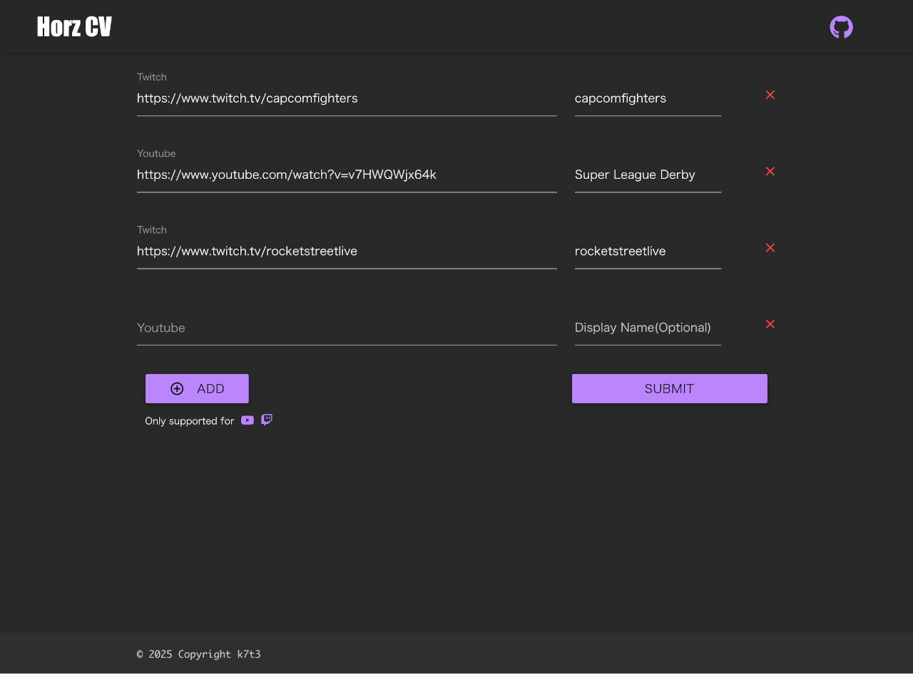
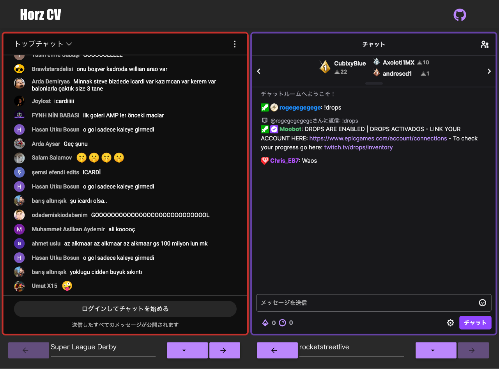

# Horz CV

**Horz CV**は、[Twitch](https://www.twitch.tv/)や[Youtube Live](https://www.youtube.com/)などの
ストリーミングサービスが提供するライブ配信のチャットを、最大6つまで同時に表示できるアプリケーションです。  

任意のライブ配信のURLを入力し、送信することでそれらのチャットが表示されます。

## スクリーンショット

## License

Copyright 2025 k7t3

Licensed under the Apache License, Version 2.0 (the "License"); you may not use this file except in compliance with the License. You may obtain a copy of the License at

http://www.apache.org/licenses/LICENSE-2.0
Unless required by applicable law or agreed to in writing, software distributed under the License is distributed on an "AS IS" BASIS, WITHOUT WARRANTIES OR CONDITIONS OF ANY KIND, either express or implied. See the License for the specific language governing permissions and limitations under the License.